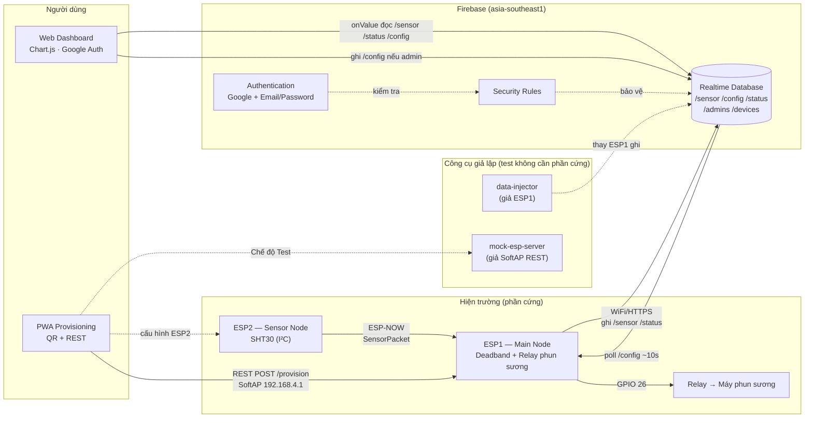
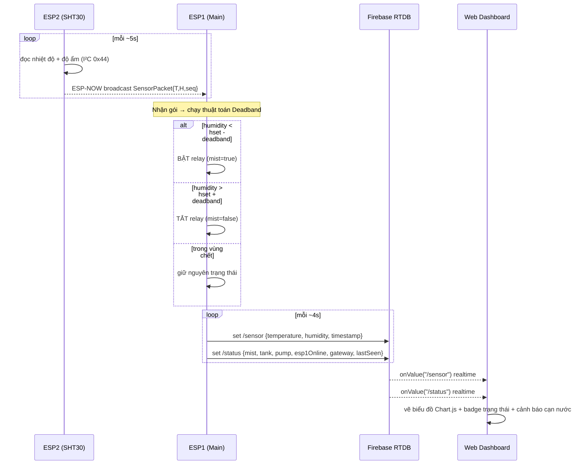
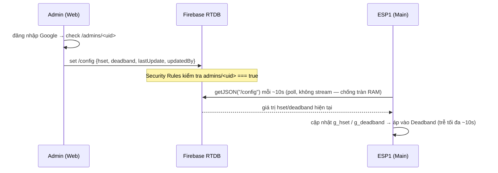
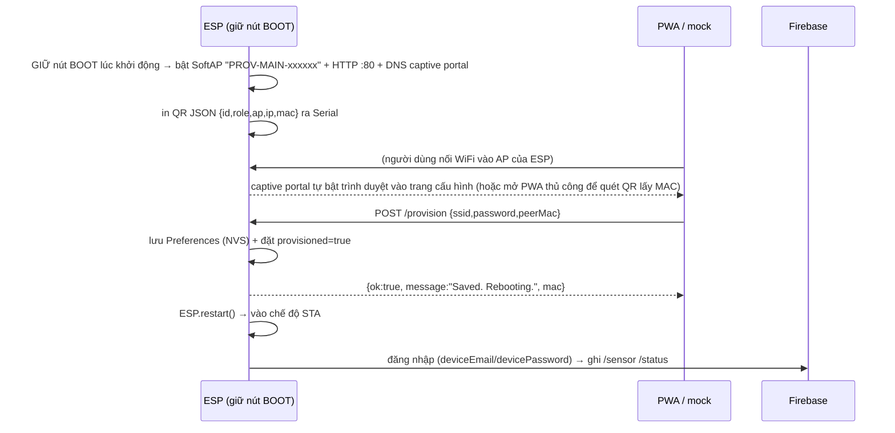
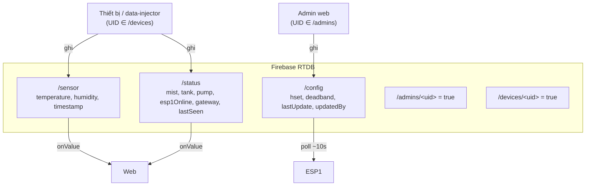

# ARCHITECTURE — Kiến trúc hệ thống & luồng dữ liệu

> Tài liệu kiến trúc cho đồ án **Smart Humidity IoT**. Mọi interface dùng chung tuân theo
> `docs/CONTRACT.md` (nguồn sự thật duy nhất). Tài liệu này giải thích các thành phần, cách chúng
> kết nối, và **3 giao thức** xương sống của hệ thống: **ESP-NOW**, **REST (provisioning)** và
> **Firebase Realtime Database**.

---

## 1. Tổng quan thành phần

Hệ thống gồm 5 nhóm thành phần chạy độc lập nhưng "khớp hợp đồng" với nhau:

| Thành phần | Vai trò | Công nghệ | Thư mục |
|---|---|---|---|
| **ESP2 — Sensor Node** | Đọc SHT30, gửi nhiệt độ/độ ẩm | C++ Arduino, ESP-NOW, I²C | `firmware/src/esp2_sensor/` |
| **ESP1 — Main Node** | Nhận ESP-NOW, chạy Deadband, điều khiển relay, đẩy Firebase | C++ Arduino, WiFi, ESP-NOW, Firebase | `firmware/src/esp1_main/` |
| **Firebase** | RTDB + Auth + Security Rules + Hosting | Realtime Database, Google/Email Auth | `firebase/`, `firebase.json` |
| **Web Dashboard** | Đăng nhập Google, biểu đồ realtime, chỉnh Hₛₑₜ/Deadband | HTML + Tailwind + Chart.js + Firebase JS SDK v10 | `web/` |
| **PWA Provisioning** | Quét QR → cấu hình WiFi cho ESP qua REST | HTML + Tailwind + html5-qrcode + Service Worker | `mobile/` |

Hai **công cụ giả lập** (cho phép demo/test KHÔNG cần phần cứng):

| Công cụ | Thay thế cho | Thư mục |
|---|---|---|
| **data-injector** | ESP1 (bơm `/sensor` + `/status` giả lên Firebase) | `tools/data-injector/` |
| **mock-esp-server** | SoftAP REST của ESP (cho PWA test provisioning) | `tools/mock-esp-server/` |

### Sơ đồ thành phần



---

## 2. Luồng dữ liệu end-to-end

### 2.1. Luồng đo & điều khiển (vòng kín)



### 2.2. Luồng chỉnh cấu hình (admin → thiết bị)



### 2.3. Luồng provisioning (cấu hình WiFi lần đầu)



---

## 3. Ba giao thức cốt lõi

### 3.1. ESP-NOW (ESP2 → ESP1)

**Mục đích:** truyền nhiệt độ/độ ẩm từ node cảm biến sang node chính mà KHÔNG cần WiFi/router —
độ trễ thấp, tiêu thụ ít, hoạt động ngay cả khi mất Internet.

- **Struct dùng chung** (`firmware/lib/common/protocol.h`), `packed`, 14 bytes, ≤ 250 bytes:

  ```cpp
  typedef struct __attribute__((packed)) {
    uint8_t  msgType;      // = MSG_SENSOR_DATA (1)
    float    temperature;  // °C
    float    humidity;     // %RH
    uint32_t seq;          // số thứ tự gói (tăng dần)
    uint8_t  fromGateway;  // 0 = bình thường, 1 = ESP2 đang gateway dự phòng
  } SensorPacket;
  ```

- **Kênh (tự đồng bộ):** ESP1 là STA nối router nên ESP-NOW của ESP1 nằm trên **kênh của router**;
  ESP1 KHÔNG ép kênh. ESP2 không nối WiFi mà **quét SSID router** (đã provisioning) để biết kênh đó rồi
  phát ESP-NOW trùng kênh (`discoverRouterChannel` + `esp_wifi_set_channel`), dò lại định kỳ ~2 phút.
  Nhờ vậy 2 board luôn cùng kênh dù router ở kênh bất kỳ; `ESPNOW_CHANNEL = 1` chỉ là **kênh dự phòng**
  khi không quét thấy SSID. ESP2 gửi **broadcast** `FF:FF:FF:FF:FF:FF` để khỏi cấu hình chéo MAC; ESP1
  nhận qua `esp_now_register_recv_cb`, kiểm tra `len == sizeof(SensorPacket)` và `msgType == MSG_SENSOR_DATA`.

### 3.2. REST provisioning (PWA/trình duyệt → SoftAP của ESP)

**Mục đích:** nạp cấu hình MẠNG (WiFi + MAC ESP còn lại) cho ESP **không cần build lại** firmware.
Khi GIỮ nút **BOOT (GPIO0)** lúc khởi động, ESP bật SoftAP + HTTP server cổng 80 tại `192.168.4.1`.
Nếu không giữ nút, ESP chạy bằng cấu hình NVS đã lưu — hoặc **hardcode fallback** khi chưa từng
provisioning (tiện cho DEV: nạp firmware là chạy ngay).

**Captive portal:** ESP còn chạy `DNSServer` trả về IP của chính nó cho MỌI tên miền, và redirect
(302) mọi request GET không khớp về `/`. Nhờ đó điện thoại **tự bật trình duyệt** ngay trang cấu
hình ngay sau khi nối AP (giống WiFi khách sạn) — không cần mở PWA hay tự gõ IP, và né được hoàn
toàn Local Network Access/mixed-content vì là HTTP same-origin từ đầu.

| Method · Endpoint | Ý nghĩa |
|---|---|
| `GET /` | trang HTML form same-origin (fallback luôn chạy) |
| `POST /provision` | nhận JSON cấu hình → lưu Preferences → reboot |
| `GET /provision` | danh tính + cấu hình đã lưu: `{id, role, mac, fw, ssid, hasPassword, peerMac, provisioned}` (không trả mật khẩu thật) |
| `POST /reset` | xoá Preferences (demo lại) |
| `POST /reboot` | `{action:true}` → khởi động lại ESP (chỉ khi đang ở SoftAP) |
| `OPTIONS *` | preflight CORS (trả 204) |

- **Body POST /provision** (CONTRACT mục 5, bản gọn): `{ ssid, password, peerMac }`.
  (`deviceEmail`/`devicePassword` giờ hardcode trong firmware; `hset`/`deadband` dùng mặc định + web.)
- **Phản hồi:** `{ ok: true, message: "Saved. Rebooting.", mac }`.
- **CORS:** ESP trả `Access-Control-Allow-Origin: *` để PWA gọi được từ trình duyệt.
- **Mixed-content:** PWA chạy HTTPS không POST thẳng tới ESP HTTP → giải pháp: mở PWA qua `http://`
  (server local) hoặc dùng trang `GET /` do ESP tự phục vụ (same-origin). Khi test không phần cứng,
  PWA bật **Chế độ Test** trỏ tới `tools/mock-esp-server` (`http://localhost:8080`).
- **QR payload** (CONTRACT mục 6, JSON 1 dòng): `{"id","role","ap","ip","mac"}` — giờ PWA chỉ dùng
  field `mac` để điền nhanh ô "MAC của ESP còn lại" (quét QR in trên ESP kia). Nhập tay vẫn được.

### 3.3. Firebase Realtime Database (đám mây ↔ thiết bị ↔ web)

**Mục đích:** lưu trữ + đồng bộ realtime giữa ESP1, web dashboard và công cụ giả lập; đồng thời là
nơi áp dụng **xác thực & phân quyền**.

- **Cây dữ liệu** (CONTRACT mục 2): `/sensor`, `/config`, `/status`, `/admins/<uid>`,
  `/devices/<uid>`. Mọi giá trị số lưu dạng `number`; thời gian là epoch giây.
- **Realtime:** ESP1 **poll** `/config` mỗi ~10s (getJSON, KHÔNG dùng stream — đổi để chỉ giữ 1 kết
  nối TLS, chống tràn RAM khi chạy Firebase lâu dài; đánh đổi độ trễ tối đa ~10s, chấp nhận được vì
  hset/deadband không phải giá trị cần phản ứng tức thời); web dùng `onValue()` của Firebase
  JS SDK v10.12.2 (modular ESM CDN).
- **Auth & Rules** (CONTRACT mục 3, `firebase/database.rules.json`):
  - Chưa đăng nhập → `.read = false` (chặn hoàn toàn).
  - **Admin** (Google OAuth, UID ∈ `/admins`) → ghi được `/config`.
  - **Thiết bị** (email/password, UID ∈ `/devices`) → ghi được `/sensor`, `/status`.
  - `/config/hset` validate `0..100`, `/config/deadband` validate `0..50`.



---

## 4. Thuật toán Deadband

Máy phun sương **làm TĂNG** độ ẩm. Vùng chết (deadband) chống "nhảy relay" liên tục quanh ngưỡng:

```
lower = hset - deadband
upper = hset + deadband

humidity < lower   → BẬT phun  (mist = true)
humidity > upper   → TẮT phun  (mist = false)
lower ≤ h ≤ upper  → giữ nguyên trạng thái
```

Cùng một logic được hiện thực ở 3 nơi (giữ nhất quán): firmware `esp1_main/main.cpp` (`runDeadband`),
`tools/data-injector/injector.js` (mô phỏng), và hiển thị Max/Min suy ra trên web
(`Max = hset+deadband`, `Min = hset-deadband`).

---

## 5. Ánh xạ "như PDF" (use-case)

- **Người lạ / chưa đăng nhập:** Rules `.read=false` → không xem được dữ liệu (đúng yêu cầu phân
  quyền trong đề).
- **Khách đã đăng nhập (không phải admin):** xem dashboard nhưng KHÔNG chỉnh được `/config` (UI khoá +
  Rules chặn).
- **Admin:** chỉnh Hₛₑₜ/Deadband → đẩy xuống ESP1 realtime.
- **Tự động hoá:** ESP1 chạy Deadband độc lập, vẫn điều khiển relay kể cả khi mất mạng (chỉ mất phần
  đẩy dữ liệu lên cloud).
- **Nâng cao:** cảnh báo cạn nước (`/status/tank = "empty"`), bơm châm nước (`/status/pump`), gateway
  dự phòng (`/status/gateway = "esp2"`).

---

## 6. Quyết định thiết kế đáng chú ý

- **Tách auth làm 2 loại** (Google cho người, email/password cho máy) để Rules phân quyền rạch ròi
  bằng `/admins` vs `/devices`.
- **Broadcast ESP-NOW ở Basic** để tránh phải cấu hình chéo MAC giữa 2 board lúc demo; `peerMac` vẫn
  được nạp để sẵn sàng chuyển sang unicast khi tích hợp thật.
- **Provisioning qua REST + Preferences (NVS)** thay vì hardcode WiFi → đổi mạng không cần build lại.
- **Công cụ giả lập** cho phép nghiệm thu toàn bộ luồng phần mềm trước khi có ESP32 thật.
- **NVS-first, hardcode-fallback + nút BOOT** (đợt 2026-07): ESP đọc cấu hình từ NVS trước, thiếu thì
  dùng hằng số `HC_*` trong firmware → nạp là chạy ngay khi dev. Vào provisioning bằng **giữ nút BOOT**
  lúc khởi động (giống thiết bị smart home), không còn kẹt SoftAP khi chưa cấu hình.
- **Tài khoản Firebase của thiết bị hardcode trong firmware** (`HC_DEV_EMAIL`/`HC_DEV_PASS`) để app
  provisioning gọn còn **WiFi + MAC**. App có **2 checkbox (WiFi/MAC)** → `POST /provision` **partial
  update** (chỉ ghi field có trong JSON, nhận cả `peerMac` lẫn `mac_gateway`).
- **Phát hiện online/offline theo `lastSeen`** (web tự suy `now − lastSeen < ~15s` + timer client),
  không dựa cờ `esp1Online` — giải bài toán "thiết bị không tự báo offline được" mà **không cần backend**.
- **Gộp ghi Firebase bằng `setJSON`**: `/sensor` và `/status` mỗi node ghi 1 lần (2 request/chu kỳ thay
  vì 9) → giảm bắt tay TLS → nhẹ CPU/sóng/nhiệt cho ESP.
- **Giữ PWA tự viết cho provisioning** (SoftAP + REST) thay vì app Espressif chính chủ: app chính chủ
  thiên về dev (cần đọc QR/POP qua terminal); luồng "nối AP → gọi API" tự viết đơn giản & consumer hơn.
  Giới hạn đã biết: PWA (web) không đọc được SSID/IP điện thoại và không auto-connect WiFi (đó là khả
  năng của app native/SmartConfig) — nên có nút test `/provision` (GET) để chẩn đoán thay thế.
- **Chống tràn flash/RAM trên ESP1** (thư viện Firebase rất nặng): đổi `board_build.partitions` sang
  `huge_app.csv` (bỏ vùng OTA thứ 2 không dùng tới, dồn ~3MB cho 1 vùng app duy nhất, tránh "Sketch
  too big"); và đổi `/config` từ **stream** sang **poll ~10s** bằng CHÍNH `fbdo` đang dùng để ghi
  `/sensor`,`/status` (bỏ `FirebaseData` riêng cho stream) — chỉ còn 1 kết nối TLS tại 1 thời điểm
  thay vì 2, giảm ~nửa RAM cho phần Firebase. Đánh đổi: hset/deadband cập nhật trễ tối đa ~10s.
